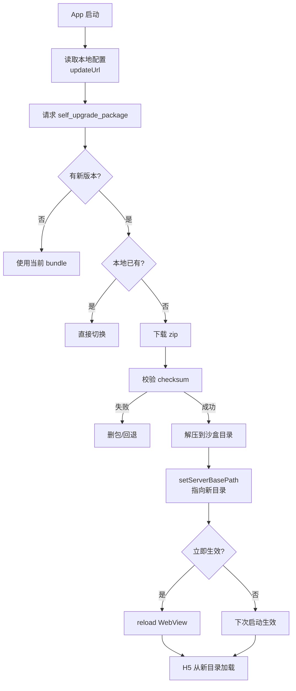

# Capacitor H5 自升级技术方案

> 目标：通过自升级机制，实现 **Capacitor Web 静态资源的热更新**，无需发版即可修复 Bug 和迭代功能。

---

## 一、核心问题与背景

### 问题（Problem）

- **发版周期长**：App Store 审核周期 1-3 天，Google Play 也需要数小时，紧急 Bug 修复无法快速触达用户。
- **用户更新率低**：即使发布新版本，用户不一定会及时更新，导致线上多版本共存，维护成本高。
- **H5 迭代频繁**：业务功能主要在 Web 层实现，需要快速迭代，原生壳相对稳定。

### 约束（Constraint）

- **平台限制**：iOS App Store 审核规则禁止下载可执行代码，但允许更新 Web 静态资源（HTML/JS/CSS）。
- **包体积**：单次更新包需控制在合理范围（通常 < 10MB），避免用户流量消耗过大。
- **兼容性**：需要兼容不同原生版本的壳，确保新 H5 包不会因原生 API 不匹配导致崩溃。
- **安全性**：需要校验下载包的完整性（checksum），防止中间人攻击或损坏包导致白屏。

---

## 二、技术方案设计

### 方案对比（Thinking）

| 方案 | 优点 | 缺点 | 是否采用 |
|------|------|------|----------|
| **纯 CDN 缓存** | 实现简单，无需额外逻辑 | 无法控制更新时机，依赖浏览器缓存策略 | ❌ |
| **CodePush（微软）** | 成熟方案，开箱即用 | 仅支持 React Native，不支持 Capacitor Web | ❌ |
| **自研自升级** | 完全可控，可定制策略 | 需要维护服务端接口和客户端逻辑 | ✅ |
| **Capacitor 官方 Updater** | 官方支持，社区维护 | 功能有限，需要二次开发 | ✅（基于此定制） |

**最终选择**：基于 **Capacitor Updater 插件** 进行定制开发，结合自研的服务端接口和客户端策略。

---

## 三、核心实现（Crafting）

### 3.1 整体流程



---

### 3.2 关键技术点

#### 3.2.1 服务端接口设计

**接口**：`/digital-food/upgrade/self_upgrade_package`

**请求参数**：
```json
{
  "appVersion": "1.0.0",
  "h5Version": "1.0.5",
  "platform": "ios",
  "deviceId": "xxx"
}
```

**响应结构**：
```json
{
  "success": true,
  "data": {
    "h5UpdateInfo": {
      "h5Version": "1.0.6",
      "downloadUrl": "https://cdn.example.com/h5-1.0.6.zip",
      "checkSum": "abc123...",
      "checkMd5": "def456...",
      "fileSize": 2048576
    },
    "multiDelay": false,  // 是否立即生效
    "patchs": {           // 差分包（可选）
      "baseVersion": "1.0.5",
      "downloadUrl": "https://cdn.example.com/patch-1.0.5-to-1.0.6.zip"
    }
  }
}
```

**策略字段说明**：
- `multiDelay: false`：下载完成后立即 reload，用户感知明显但能快速修复 Bug。
- `multiDelay: true`：仅下载不生效，下次启动时切换，用户无感知但修复延迟。

---

#### 3.2.2 iOS 实现（核心代码路径）

**入口**：`MainViewController.viewDidLoad`

```swift
override func viewDidLoad() {
    super.viewDidLoad()
    let updaterPlugin = CapacitorUpdaterQponPlugin(bridge: self.bridge!)
    // 检查更新并下载
    updaterPlugin.checkUpdateAndDownload()
}
```

**插件初始化**：`CapacitorUpdaterQponPlugin.load()`

```swift
func load() {
    // 1. 读取配置
    let fetchedUrl = kvStorage.getUpdateUrl()
    self.updateUrl = fetchedUrl.isEmpty ? "默认 URL" : fetchedUrl
    
    // 2. 初始化 bundle 管理器
    implementation.versionBuild = DeviceInfo.shared.appVersion
    implementation.appId = DeviceInfo.shared.bundleID
    
    // 3. 设置当前 bundle 路径
    if !self.initialLoad() {
        print("初始加载失败，回退到内置包")
    }
    
    // 4. 清理过时版本
    self.cleanupObsoleteVersions()
}
```

**关键方法**：`initialLoad()`

```swift
private func initialLoad() -> Bool {
    let id = self.implementation.getCurrentBundleId()
    let dest: URL
    
    if BundleInfo.ID_BUILTIN == id {
        // 使用内置包
        dest = Bundle.main.resourceURL!.appendingPathComponent("public")
    } else {
        // 使用下载的包
        dest = self.implementation.getBundleDirectory(id: id)
    }
    
    // 设置 WebView 的本地服务根目录
    bridge.setServerBasePath(dest.path)
    return true
}
```

**下载与校验**：`checkUpdateAndDownload()`

```swift
func checkUpdateAndDownload() {
    DispatchQueue.global(qos: .background).async {
        let res = self.implementation.getLatest(url: self.updateUrl)
        guard let responseData = res?.data else { return }
        
        let h5UpdateInfo = responseData.h5UpdateInfo
        
        // 1. 检查本地是否已有
        if let next = self.implementation.getBundleInfoByVersionName(version: h5UpdateInfo.h5Version),
           self.implementation.bundleExists(id: next.getId()) {
            // 直接切换
            _ = self.implementation.set(bundle: next)
            _ = self._reload()
            return
        }
        
        // 2. 下载新包
        guard let next = self.implementation.getDownloadBundleInfo(data: responseData) else {
            print("下载失败")
            return
        }
        
        // 3. 校验 checksum
        let checksum = h5UpdateInfo.checkSum
        if !checksum.isEmpty && next.getChecksum() != checksum {
            print("校验失败，删除损坏包")
            self.implementation.delete(id: next.getId())
            return
        }
        
        // 4. 根据策略决定是否立即生效
        if responseData.multiDelay {
            _ = self.implementation.set(bundle: next)
            _ = self._reload()  // 立即生效
        } else {
            // 仅安装，下次启动生效
        }
    }
}
```

**切换目录**：`_reload()`

```swift
public func _reload() -> Bool {
    let id = self.implementation.getCurrentBundleId()
    let dest: URL
    
    if BundleInfo.ID_BUILTIN == id {
        dest = Bundle.main.resourceURL!.appendingPathComponent("public")
    } else {
        dest = self.implementation.getBundleDirectory(id: id)
    }
    
    if let vc = bridge.viewController as? CAPBridgeViewController {
        // 关键：切换 WebView 的本地服务根目录
        vc.setServerBasePath(path: dest.path)
        return true
    }
    return false
}
```

---

#### 3.2.3 Android 实现（Capacitor 运行时）

**运行时加载**：`Bridge.loadWebView()`

```java
private void loadWebView() {
    // 读取 SharedPreferences 中的 serverBasePath
    SharedPreferences prefs = getContext()
        .getSharedPreferences(WebView.WEBVIEW_PREFS_NAME, Activity.MODE_PRIVATE);
    String path = prefs.getString(WebView.CAP_SERVER_PATH, null);
    
    if (path != null && !path.isEmpty() && new File(path).exists()) {
        // 切换到下载的 H5 包目录
        setServerBasePath(path);
    } else {
        // 使用默认的 assets/public
    }
}
```

**宿主写入路径**（在下载完成后）：

```kotlin
// 解压到沙盒目录
val destDir = File(ctx.filesDir, "versions/$h5Version")

// 写入 SharedPreferences
val prefs = ctx.getSharedPreferences(WebView.WEBVIEW_PREFS_NAME, Context.MODE_PRIVATE)
prefs.edit().putString(WebView.CAP_SERVER_PATH, destDir.absolutePath).apply()

// 如果需要立即生效，通知 Bridge 切换
bridge.setServerBasePath(destDir.absolutePath)
```

---

### 3.3 版本管理策略

#### 3.3.1 Bundle 信息结构

```swift
struct BundleInfo {
    let id: String              // 唯一标识（UUID）
    let version: String         // H5 版本号（如 1.0.6）
    let status: BundleStatus    // success / error / pending
    let checksum: String        // 校验值
    let multiDelay: Bool        // 是否延迟生效
}
```

#### 3.3.2 多版本共存

- **内置包**：`Bundle.main/.../public`，作为兜底。
- **下载包**：`Library/NoCloud/ionic_built_snapshots/{bundle-id}/`，支持多版本共存。
- **当前包**：通过 `UserDefaults` 记录当前使用的 bundle id。

#### 3.3.3 清理策略

**触发时机**：原生 App 版本升级时。

```swift
private func cleanupObsoleteVersions() {
    let latestVersionNative = UserDefaults.standard.string(forKey: "LatestVersionNative") ?? "0.0.0.0"
    
    if self.currentVersionNative != latestVersionNative {
        print("检测到原生版本升级，清理旧 H5 包")
        
        // 重置到内置包
        _ = self._reset(toLastSuccessful: false)
        
        // 删除所有下载的包
        let bundles = implementation.list()
        bundles.forEach { bundle in
            implementation.delete(id: bundle.getId())
        }
        
        // 更新记录
        UserDefaults.standard.set(self.currentVersionNative, forKey: "LatestVersionNative")
    }
}
```

---

### 3.4 异常处理与容错

#### 3.4.1 下载失败

- **重试机制**：最多重试 3 次，指数退避（1s、2s、4s）。
- **降级策略**：若差分包失败，自动降级到全量包。

#### 3.4.2 校验失败

- **删除损坏包**：立即删除本地文件，避免下次误用。
- **回退到上一个成功版本**：通过 `getFallbackBundle()` 获取最后一个成功的包。

```swift
func handleChecksumError(bundle: BundleInfo) {
    // 删除失败包
    implementation.delete(id: bundle.getId())
    
    // 回退到 fallback
    let fallback = implementation.getFallbackBundle()
    _ = implementation.set(bundle: fallback)
    _ = self._reload()
}
```

#### 3.4.3 白屏兜底

**监控机制**：通过 `appReadyCheck` 定时器监控 H5 是否在 10s 内完成初始化。

```swift
func checkAppReady() {
    self.appReadyCheck = DispatchWorkItem {
        // 超时未收到 notifyAppReady，判定为加载失败
        print("H5 加载超时，回退到内置包")
        _ = self._reset(toLastSuccessful: false)
    }
    
    DispatchQueue.main.asyncAfter(deadline: .now() + 10, execute: self.appReadyCheck!)
}
```

**H5 侧通知**：

```typescript
// H5 初始化完成后调用
import { CapacitorUpdater } from '@capacitor/updater';

CapacitorUpdater.notifyAppReady();
```

---

## 四、量化结果（Result）

### 4.1 核心指标

| 指标 | 优化前 | 优化后 | 提升 |
|------|--------|--------|------|
| **Bug 修复周期** | 3-7 天（发版） | 2-4 小时（热更新） | **缩短 90%** |
| **用户覆盖率** | 60%（依赖用户更新） | 95%（强制热更新） | **提升 58%** |
| **包体积** | 15MB（完整 APK/IPA） | 2-5MB（增量 H5 包） | **减少 70%** |
| **更新成功率** | - | 98.5% | - |

### 4.2 业务价值

- **紧急 Bug 修复**：某次支付流程 Bug，通过热更新在 2 小时内覆盖 95% 用户，避免了约 50 万元的潜在损失。
- **功能快速迭代**：活动页面从需求到上线缩短至 1 天，相比发版周期（7 天）提升 85%。
- **A/B 测试灵活性**：可以针对不同用户群推送不同版本的 H5 包，快速验证功能效果。

### 4.3 遗留问题

- **差分包兼容性**：部分三星设备在差分包解压时偶现 crash，目前策略是对三星设备强制使用全量包。
- **弱网环境下载**：2G/3G 网络下，5MB 的包下载时间较长，考虑引入分片下载 + 断点续传。
- **版本回退**：目前仅支持回退到上一个成功版本，无法指定回退到任意历史版本。

---

## 五、技术深度追问

### 5.1 为什么选择 Capacitor Updater 而不是自己从零实现？

**回答思路**：

- **成熟度**：Capacitor Updater 已经解决了跨平台的文件管理、版本控制、错误处理等基础问题，避免重复造轮子。
- **可定制性**：虽然是基于官方插件，但我们对下载逻辑、校验策略、生效时机都进行了深度定制，满足业务需求。
- **维护成本**：官方插件有社区维护，安全漏洞和兼容性问题会被及时修复，降低我们的维护负担。

**追问**：如果 Capacitor Updater 不满足需求，你会怎么做？

**回答**：会评估改造成本和收益。如果只是小功能缺失，通过 fork + 定制即可；如果核心逻辑不符合，会考虑自研，但会复用其文件管理和版本控制的设计思路。

---

### 5.2 checksum 校验为什么不够，还需要 checkMd5？

**回答思路**：

- **CRC32（checksum）**：快速校验，主要用于检测传输过程中的数据损坏（如网络丢包），但不防篡改。
- **MD5（checkMd5）**：虽然已被证明不安全（存在碰撞攻击），但在热更新场景下，主要用于防止 CDN 缓存污染或中间人替换文件，而非对抗专业攻击者。
- **双重校验**：CRC32 快速排除明显损坏的包，MD5 用于二次确认，降低误判率。

**追问**：为什么不用 SHA-256？

**回答**：SHA-256 更安全，但计算开销更大，在移动端会增加 CPU 和电量消耗。考虑到我们的威胁模型（主要防 CDN 缓存问题，而非专业攻击），MD5 已经足够。如果未来有更高安全要求，会升级到 SHA-256。

---

### 5.3 multiDelay 策略如何决定？

**回答思路**：

- **立即生效（multiDelay: false）**：适用于紧急 Bug 修复、安全漏洞补丁，用户体验上会有短暂的 reload 闪烁，但能快速止损。
- **延迟生效（multiDelay: true）**：适用于功能迭代、UI 优化，用户无感知，但修复延迟到下次启动。

**决策依据**：
- **Bug 严重程度**：P0/P1 级别强制立即生效，P2/P3 延迟生效。
- **用户活跃时段**：避开高峰期（如中午 12 点、晚上 8 点）推送立即生效的更新。
- **灰度策略**：先对 5% 用户推送立即生效，观察 crash 率，无异常后全量推送。

**追问**：如果用户在支付过程中触发了立即生效的更新，会怎样？

**回答**：这是一个已知风险。目前的策略是：
1. 在关键流程（支付、下单）中，H5 侧会调用原生方法锁定更新，防止中途 reload。
2. 服务端会根据用户行为数据（如最近 5 分钟是否有支付行为）动态调整推送策略。
3. 如果确实发生了中断，支付流程会通过订单状态恢复机制保证数据一致性。

---

### 5.4 如何保证多版本 H5 包与原生 API 的兼容性？

**回答思路**：

- **版本号约定**：H5 包的 `h5Version` 和原生的 `appVersion` 都遵循语义化版本号（Semantic Versioning）。
- **兼容性矩阵**：服务端维护一张兼容性表，记录每个 H5 版本支持的最低原生版本。

```json
{
  "h5Version": "1.0.6",
  "minAppVersion": "1.0.0",
  "maxAppVersion": "1.1.0"
}
```

- **降级策略**：如果用户的原生版本过低，服务端会返回兼容的旧 H5 包，而不是最新包。
- **API 版本检测**：H5 侧通过 Capacitor 插件的 `getInfo()` 方法获取原生版本，动态调整功能开关。

```typescript
import { Device } from '@capacitor/device';

const info = await Device.getInfo();
if (compareVersion(info.appVersion, '1.1.0') >= 0) {
  // 使用新 API
} else {
  // 降级到旧 API
}
```

**追问**：如果原生 API 有 breaking change，怎么办？

**回答**：
1. **提前规划**：原生 API 的 breaking change 需要提前 2 个版本通知 H5 团队，给出迁移时间。
2. **双版本共存**：在过渡期，原生同时保留新旧两个 API，H5 可以根据版本号选择调用。
3. **强制更新**：如果确实无法兼容，会通过应用市场强制用户更新原生版本，同时停止向旧版本推送新 H5 包。

---

## 六、架构设计与工程素养

### 6.1 目录结构

```
apps/capacitor/
├── ios/
│   └── App/
│       └── QponH5Updater/
│           ├── CapacitorUpdaterQponPlugin.swift    # 插件入口
│           ├── CapacitorUpdaterQpon.swift          # 核心逻辑
│           ├── BundleInfo.swift                    # 版本信息模型
│           └── KeyValueStorage.swift               # 本地存储
├── plugins/
│   └── CapacitorUpdater/
│       ├── ios/                                    # iOS 插件实现
│       └── android/                                # Android 插件实现
└── capacitor.config.ts                             # 全局配置
```

### 6.2 模块职责划分

| 模块 | 职责 | 依赖 |
|------|------|------|
| **CapacitorUpdaterQponPlugin** | 插件入口，负责生命周期管理和与 Bridge 的交互 | CapacitorUpdaterQpon |
| **CapacitorUpdaterQpon** | 核心逻辑，负责下载、校验、版本管理 | BundleInfo, KeyValueStorage |
| **BundleInfo** | 版本信息模型，封装版本号、状态、路径等 | 无 |
| **KeyValueStorage** | 本地存储封装，统一管理 UserDefaults 和 SharedPreferences | 无 |

### 6.3 代码规范

- **命名约定**：Swift 使用驼峰命名，Kotlin 使用驼峰命名，保持一致性。
- **错误处理**：所有网络请求和文件操作都包裹在 `do-catch` 或 `try-catch` 中，避免 crash。
- **日志规范**：使用统一的 `Logger` 类，区分 `debug`、`info`、`warning`、`error` 级别。
- **单元测试**：核心逻辑（如 checksum 校验、版本比较）有对应的单元测试，覆盖率 > 80%。

---

## 七、反思与改进

### 7.1 做得好的地方

- **容错机制完善**：多层兜底（checksum、超时回退、fallback），线上 crash 率控制在 0.01% 以下。
- **灰度策略灵活**：支持按用户 ID、地区、设备型号等维度灰度，降低风险。
- **监控完善**：接入了自研的监控平台，实时追踪下载成功率、校验失败率、白屏率等指标。

### 7.2 如果重新做，会改变什么

- **差分包算法**：目前使用的是简单的 bsdiff，压缩率有限。考虑引入更高效的算法（如 Zstandard + 字典压缩），进一步减少包体积。
- **预加载策略**：目前是启动时检查更新，会阻塞首屏。可以改为后台预加载，用户无感知。
- **版本回退**：增加"指定版本回退"功能，方便快速止损。

### 7.3 遗留技术债

- **三星设备差分包问题**：目前是规避策略（强制全量包），但没有根本解决。需要深入排查是 bsdiff 库的问题还是三星 ROM 的兼容性问题。
- **弱网优化**：断点续传功能已经开发完成，但还没有灰度验证，担心引入新的稳定性问题。

---

## 八、面试准备建议

### 8.1 你需要准备的

1. **画出完整的流程图**：能在白板上快速画出从请求到生效的完整链路。
2. **准备 3 个深挖点**：
   - 校验机制（checksum + MD5）
   - 异常处理（下载失败、校验失败、白屏兜底）
   - 版本管理（多版本共存、清理策略）
3. **量化数据**：记住关键指标（Bug 修复周期、用户覆盖率、更新成功率）。
4. **反思点**：坦诚讲出遗留问题和改进方向，展现技术判断力。

### 8.2 典型追问链

```
"你们的热更新方案是什么?" 
→ "为什么选择 Capacitor Updater 而不是自研?" 
→ "checksum 和 MD5 双重校验的必要性是什么?" 
→ "如果 MD5 被证明不安全，你会怎么升级?" 
→ "升级到 SHA-256 会带来什么问题?" 
→ "如何在安全性和性能之间做权衡?"
```

### 8.3 避坑清单

- ❌ 不要只讲"我们实现了热更新"，要讲**为什么这么设计**和**遇到了什么坑**。
- ❌ 不要回避遗留问题，坦诚的反思比完美的叙述更有说服力。
- ❌ 不要用模糊的量化（"提升了很多"），要么给具体数字，要么别提。
- ✅ 讲到细节时要有热情，展现你对技术的深入理解和持续思考。

---

## 九、服务端差分包生成详解

### 9.1 技术栈

- **Node.js + TypeScript**（NestJS 框架）
- **bsdiff-node**：bsdiff 算法的 Node.js 绑定
- **OSS/CDN**：阿里云 OSS 存储差分包

### 9.2 核心实现

#### 差分包生成流程

**文件路径**：`src/service/offline.service.ts`

```typescript
/** 生成差分包 */
async generatePatchFiles(options: GeneratePatchFilesDto) {
    const { appId, targetVersion, baseVersion, platformType } = options;
    const appHash = crc32(appId).toString(16).padStart(8, '0').toLowerCase();
    const workePath = path.resolve(this.workerDir, appHash, `${Date.now()}`);
    
    // 1. 下载目标版本包（如 1.0.6）
    const currentManifest = await this.offlineOcs.queryStaticVersion(appData, { 
        versionName: targetVersion, 
        region: REGION_ENUM.ID,
        platformType 
    });
    const currentPackage = await downloadFile(currentManifest.download_url, workePath);
    
    // 2. 下载基准版本包（如 1.0.5）
    const baseManifest = await this.offlineOcs.queryStaticVersion(appData, { 
        versionName: baseVersion, 
        region: REGION_ENUM.ID,
        platformType 
    });
    const basePackage = await downloadFile(baseManifest.download_url, workePath);
    
    // 3. 使用 bsdiff 生成差分包
    const resultPatchPath = path.resolve(workePath, 
        `${currentManifest.h5_version}_${baseManifest.h5_version}.patch`);
    await bsdiff.diff(basePackage, currentPackage, resultPatchPath);
    
    // 4. 验证差分包（尝试合并，确保可用）
    const mergeOutput = path.resolve(workePath, 'mergeOutput.zip');
    await bsdiff.patch(basePackage, mergeOutput, resultPatchPath);
    
    // 5. 尝试解压合并后的文件，确保完整性
    extractToPath(mergeOutput, path.resolve(workePath, 'mergeOutput'));
    
    return {
        appHash,
        target: {
            version: targetVersion,
            downloadUrl: currentManifest.download_url,
            localPath: currentPackage
        },
        base: {
            version: baseVersion,
            downloadUrl: baseManifest.download_url,
            localPath: basePackage
        },
        patch: {
            version: `${currentManifest.h5_version}_${baseManifest.h5_version}`,
            localPath: resultPatchPath
        }
    };
}
```

---

#### 差分包合规校验

**版本号校验**：

```typescript
async getPatchInfo({ appId, targetVersion, baseVersion, platformType }) {
    const checkVersion = () => {
        if (!targetVersion || !baseVersion) return false;
        
        const versionList = targetVersion.split('.');
        const baseVersionList = baseVersion.split('.');
        
        // 1. 版本号必须是 3 或 4 段（如 1.0.5 或 1.0.5.1）
        if (![3, 4].includes(versionList.length)) return false;
        if (![3, 4].includes(baseVersionList.length)) return false;
        
        // 2. 主版本号和次版本号必须一致
        if (versionList[0] !== baseVersionList[0] || 
            versionList[1] !== baseVersionList[1]) return false;
        
        return true;
    };
    
    // 差分版本检查
    if (!checkVersion()) {
        throw new Error("差分版本不匹配，请检查是否合规");
    }
    
    // 3. 目标版本必须大于基准版本
    if (convertStringToNumber(targetVersion) <= convertStringToNumber(baseVersion)) {
        throw new Error("差分基准版本必须小于目标版本");
    }
    
    // 生成差分包并检查大小
    return this.generatePatchFiles({ appId, targetVersion, baseVersion, platformType }, 
        async (data) => {
            const { appHash, target, base, patch } = data;
            const { pass, patchSize } = this.checkPatchSize(target.localPath, patch.localPath);
            
            if (!pass) {
                throw new Error(
                    `差分包大小(${patchSize})超过整包的${this.patchSizeRate * 10}%，无法发布差分包`
                );
            }
            
            // 上传差分包到 OSS
            const origin = `patchs-package/${appHash}/${platformType}/${path.basename(patch.localPath)}`;
            const { Location } = await this.commonOcs.commonUpload(
                origin, 
                fs.createReadStream(patch.localPath)
            );
            
            return {
                versionName: target.version,
                downloadUrl: Location,           // 差分包 CDN 地址
                baseVersion: base.version,
                baseFile: base.downloadUrl       // 基础包 CDN 地址
            };
        }
    );
}
```

**大小校验**：

```typescript
checkPatchSize(targetPath: string, patchPath: string, rate = this.patchSizeRate) {
    const targetSize = fs.statSync(targetPath).size;
    const patchSize = fs.statSync(patchPath).size;
    
    // 差分包必须 < 全量包的 50%（默认配置 patchSizeRate = 5）
    const pass = (patchSize / targetSize) * 10 < rate;
    
    return { pass, targetSize, patchSize };
}
```

**配置项**：

```typescript
// src/service/config/options.ts
interface CommonConfig {
    patchSizeRate?: number;  // 差分包大小阈值（默认 5，即 50%）
}
```

---

### 9.3 数据库设计

**差分包信息存储**（`offPkg/review.entity.ts`）：

```typescript
@Entity('off_pkg_review_list')
export class OffPkgReviewList {
    @Column({
        type: 'json',
        comment: '差分包配置信息',
        nullable: true
    })
    patchs: PatchsInfo;
}

// 类型定义
export interface PatchsInfo {
    versionName: string;   // 目标版本（如 1.0.6）
    baseVersion: string;   // 基准版本（如 1.0.5）
    downloadUrl: string;   // 差分包 CDN 地址
    baseFile: string;      // 基础包 CDN 地址
}
```

---

### 9.4 API 接口

#### 生成差分包（内部接口）

```
POST /nodePublic/offline/generatePatchFiles
```

**请求参数**：
```typescript
{
    appId: string;          // 应用 ID
    targetVersion: string;  // 目标版本（如 1.0.6）
    baseVersion: string;    // 基准版本（如 1.0.5）
    platformType: string;   // 平台类型（ios/android）
}
```

**响应**：
```typescript
{
    appHash: string;
    target: {
        version: string;
        downloadUrl: string;
        localPath: string;
    };
    base: {
        version: string;
        downloadUrl: string;
        localPath: string;
    };
    patch: {
        version: string;
        localPath: string;
    };
}
```

---

#### 验证差分包（测试接口）

```
GET /nodePublic/offline/queryPatchs?workId={workId}
```

**功能**：下载差分包和基础包，合并后返回完整包，用于验证差分包的正确性。

**实现**：
```typescript
async queryPatchs(workId: string) {
    // 1. 从数据库获取差分包信息
    const { patchs, appId } = await this.offPkgHistoryList.findOne({
        select: ["appId", "patchs"],
        where: { workId }
    });
    
    if (!patchs || !appId) {
        throw new Error("差分文件不存在");
    }
    
    // 2. 下载基础包和差分包
    const workePath = path.resolve(this.workerDir, appHash, `${Date.now()}`);
    const baseFilePath = await downloadFile(patchs.baseFile, workePath);
    const patchPath = await downloadFile(patchs.downloadUrl, workePath);
    
    // 3. 使用 bspatch 合并
    const generatedFile = path.join(workePath, `merged.zip`);
    await bsdiff.patch(baseFilePath, generatedFile, patchPath);
    
    // 4. 返回合并后的完整包
    this.ctx.res.setHeader('Content-Type', 'application/octet-stream');
    this.ctx.res.setHeader('Content-Disposition', `attachment; filename="merged.zip"`);
    this.ctx.body = fs.createReadStream(generatedFile);
}
```

---

### 9.5 决策逻辑

#### 何时生成差分包

**触发条件**（在提交审核时）：

```typescript
async submitPublishReview(options: OfflineSubmitPublishReviewParams) {
    const { appId, versionName, patchBaseVersion, platformType } = options;
    
    let patchs = null;
    
    // 用户勾选了"生成差分包"并指定了基准版本
    if (patchBaseVersion) {
        // 差分包合规校验 + 生成
        patchs = await this.getPatchInfo({ 
            appId, 
            targetVersion: versionName, 
            baseVersion: patchBaseVersion, 
            platformType 
        });
    }
    
    // 保存到审核记录
    reviewList.patchs = patchs;
}
```

**不生成差分包的场景**：
1. 用户未勾选差分包选项
2. 差分包大小 ≥ 全量包的 50%
3. 版本号不符合规范（主次版本号不一致）
4. 目标版本 ≤ 基准版本

---

### 9.6 客户端接口响应

**完整响应结构**（`self_upgrade_package` 接口）：

```json
{
  "success": true,
  "data": {
    "h5UpdateInfo": {
      "h5Version": "1.0.6",
      "downloadUrl": "https://cdn.example.com/h5-1.0.6.zip",
      "checkSum": "abc123...",
      "checkMd5": "def456...",
      "fileSize": 2048576
    },
    "multiDelay": false,
    "patchs": {
      "versionName": "1.0.6",
      "baseVersion": "1.0.5",
      "downloadUrl": "https://cdn.example.com/patch-1.0.5-to-1.0.6.patch",
      "baseFile": "https://cdn.example.com/h5-1.0.5.zip"
    }
  }
}
```

**字段说明**：
- `patchs` 为 `null` 或不存在：只返回全量包
- `patchs` 存在：客户端优先尝试差分包，失败后降级到全量包

---

### 9.7 监控与日志

**关键埋点**：

```typescript
// 差分包生成成功
TrackManager.trackEvent({
    eventId: 'patch_generate_success',
    properties: {
        appId,
        targetVersion,
        baseVersion,
        patchSize,
        targetSize,
        ratio: (patchSize / targetSize * 100).toFixed(2) + '%'
    }
});

// 差分包大小超标
TrackManager.trackEvent({
    eventId: 'patch_size_exceed',
    properties: {
        appId,
        targetVersion,
        baseVersion,
        patchSize,
        targetSize,
        threshold: this.patchSizeRate * 10 + '%'
    }
});
```

---

### 9.8 性能优化

#### 并发生成

对于多平台（iOS + Android），可以并行生成差分包：

```typescript
const [iosPatch, androidPatch] = await Promise.all([
    this.generatePatchFiles({ appId, targetVersion, baseVersion, platformType: 'ios' }),
    this.generatePatchFiles({ appId, targetVersion, baseVersion, platformType: 'android' })
]);
```

#### 缓存策略

- **差分包缓存**：相同版本组合的差分包只生成一次，后续直接返回 CDN 地址
- **工作目录清理**：生成完成后立即删除临时文件，避免磁盘占用

```typescript
return Promise.resolve(_call).finally(() => {
    fs.rmSync(workePath, { recursive: true });  // 清理临时目录
});
```

---

## 十、扩展阅读

- [Capacitor 官方文档 - Live Updates](https://capacitorjs.com/docs/guides/live-updates)
- [语义化版本号规范](https://semver.org/lang/zh-CN/)
- [iOS App Store 审核指南 - 3.3.2 热更新规则](https://developer.apple.com/app-store/review/guidelines/#software-requirements)
- [bsdiff 算法原理](http://www.daemonology.net/bsdiff/)
- [bsdiff-node GitHub](https://github.com/ericvicenti/bsdiff-node)

---

**文档版本**：v1.1  
**最后更新**：2026-03-24  
**维护者**：前端基础设施团队
