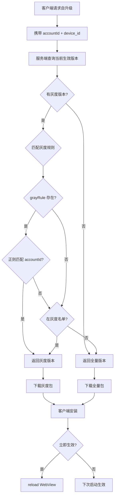
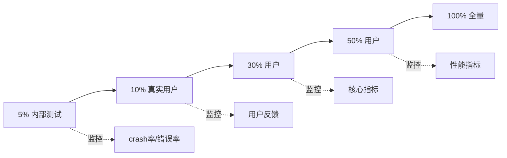

# Capacitor H5 自升级灰度发布方案

> 目标：通过灰度发布机制，**降低 H5 热更新风险**，实现小范围验证后逐步扩大覆盖面。

---

## 一、核心问题与背景

### 问题（Problem）

- **全量发布风险高**：一旦 H5 包有 Bug，会立即影响所有用户，造成大规模故障。
- **回滚成本高**：发现问题后需要紧急回滚，但已经有大量用户受影响。
- **测试环境与生产环境差异**：测试环境无法完全模拟生产环境的复杂场景（网络、设备、用户行为）。
- **新功能验证困难**：无法在真实用户中小范围验证新功能效果。

### 约束（Constraint）

- **用户体验**：灰度用户和非灰度用户的体验差异不能过大，避免用户困惑。
- **技术实现**：需要在客户端请求时实时判断，不能有明显的性能损耗。
- **运维成本**：灰度策略需要灵活可配置，不能每次都需要发版。
- **数据一致性**：灰度版本和全量版本的数据格式必须兼容，避免数据错乱。

---

## 二、技术方案设计

### 方案对比（Thinking）

| 方案 | 优点 | 缺点 | 是否采用 |
|------|------|------|----------|
| **客户端随机灰度** | 实现简单，客户端自主决策 | 无法精确控制灰度用户，难以追踪问题 | ❌ |
| **CDN 灰度** | 利用 CDN 能力，无需改造 | 灰度策略不灵活，无法按用户维度控制 | ❌ |
| **服务端规则匹配** | 灵活可控，支持多种策略 | 需要服务端支持，增加请求复杂度 | ✅ |
| **A/B 测试平台** | 功能强大，支持多变量实验 | 引入第三方依赖，成本高 | ❌ |

**最终选择**：**服务端规则匹配**，支持 **正则规则 + 白名单** 两种方式，且可同时配置（OR 逻辑）。

---

## 三、核心实现（Crafting）

### 3.1 整体流程



---

### 3.2 灰度策略

#### 策略1：正则规则（grayRule）

**适用场景**：按用户 ID 特征灰度，如内部测试用户、特定地区用户。

**配置示例**：
```json
{
    "effectiveScope": "2",  // 2 = 灰度发布
    "grayRule": "^(test_|admin_|dev_)"
}
```

**匹配逻辑**：
```typescript
if (gray.grayRule) {
    if (new RegExp(gray.grayRule).test(accountId)) {
        return true;  // 命中灰度
    }
}
```

**命中示例**：
- `accountId = "test_user_001"` ✅ 命中
- `accountId = "admin_zhang"` ✅ 命中
- `accountId = "normal_user"` ❌ 不命中

---

#### 策略2：白名单（grayList）

**适用场景**：指定特定用户或设备灰度，如 VIP 用户、测试设备。

**配置示例**：
```json
{
    "effectiveScope": "2",
    "grayList": [
        { "grayId": "user_12345", "grayName": "测试用户A" },
        { "grayId": "device_abc123", "grayName": "测试设备B" }
    ]
}
```

**匹配逻辑**：
```typescript
if (await this.grayModel.existsBy({ 
    workId: gray.workId, 
    grayId: In([accountId, device_id]) 
})) {
    return true;  // 在白名单中
}
```

**命中示例**：
- `accountId = "user_12345"` ✅ 命中
- `device_id = "device_abc123"` ✅ 命中
- `accountId = "other_user"` ❌ 不命中

---

#### 策略3：规则 + 名单组合（OR 逻辑）

**适用场景**：既要覆盖一批用户（规则），又要包含特定用户（名单）。

**配置示例**：
```json
{
    "effectiveScope": "2",
    "grayRule": "^admin_",
    "grayList": [
        { "grayId": "user_vip_001" },
        { "grayId": "user_vip_002" }
    ]
}
```

**匹配逻辑**（OR 关系）：
```typescript
async matchGray(gray, { accountId, device_id }) {
    if (!gray) return false;
    
    // 1. 检查规则匹配
    if (gray.grayRule) {
        if (new RegExp(gray.grayRule).test(accountId)) {
            return true;
        }
    }
    
    // 2. 检查名单匹配（无论是否有规则，都检查）
    if (await this.grayModel.existsBy({ 
        workId: gray.workId, 
        grayId: In([accountId, device_id]) 
    })) {
        return true;
    }
    
    return false;
}
```

**命中示例**：
- `accountId = "admin_zhang"` ✅ 命中（规则匹配）
- `accountId = "user_vip_001"` ✅ 命中（名单匹配）
- `accountId = "normal_user"` ❌ 不命中

---

### 3.3 服务端实现

#### 提交灰度审核

**接口**：`POST /nodePublic/offline/submitReview`

**请求参数**：
```typescript
interface SubmitReviewParams {
    appId: string;
    versionName: string;           // 版本号（如 1.0.6）
    platformType: "ios" | "android";
    effectiveScope: "1" | "2" | "3";  // 1=全量, 2=灰度, 3=回退
    immediateUpdate: boolean;      // 是否立即生效
    
    // 灰度配置（effectiveScope=2 时必填至少一项）
    grayRule?: string;             // 灰度规则（正则表达式）
    grayList?: Array<{             // 灰度名单
        grayId: string;            // 用户ID 或 设备ID
        grayName?: string;         // 名称（可选）
    }>;
    
    patchBaseVersion?: string;     // 差分包基准版本（可选）
    description: string;           // 描述
}
```

**核心代码**：
```typescript
async submitReview(options: OfflineSubmitPublishReviewParams) {
    const { appId, effectiveScope, grayList, grayRule, versionName } = options;
    
    // 灰度发布时，至少需要配置规则或名单之一
    if (effectiveScope === EFFECTIVE_SCOPE_ENUM.GRAY && 
        !grayRule?.trim() && 
        !grayList?.length) {
        throw new Error('灰度规则或名单未上传');
    }
    
    // 创建审核记录
    const reviewList = new OffPkgReviewList();
    reviewList.appId = appId;
    reviewList.workId = v4();
    reviewList.versionName = versionName;
    reviewList.effectiveScope = effectiveScope;
    reviewList.immediateUpdate = options.immediateUpdate;
    
    // 保存灰度配置
    if (effectiveScope === EFFECTIVE_SCOPE_ENUM.GRAY) {
        // 支持同时配置规则和名单
        if (grayRule?.trim()) {
            reviewList.grayRule = grayRule.trim();
        }
        if (grayList?.length) {
            // 存入灰度名单表
            await this.grayRosterList.save(grayList.map(item => {
                return Object.assign(new GrayRoster(), item, { 
                    workId: reviewList.workId 
                });
            }));
        }
    }
    
    await this.offPkgAppInfo.save(appData);
    return reviewList;
}
```

---

#### 客户端请求匹配

**接口**：`POST /digital-food/upgrade/self_upgrade_package`

**请求参数**：
```typescript
{
    app_id: string;
    platform: "ios" | "android";
    client_version_name: string;
    h5_cur_version_name: string;
    accountId: string;           // 用户ID（关键！）
    device_id: string;           // 设备ID（关键！）
    region: string;
}
```

**核心代码**：
```typescript
async getVersionJson() {
    const { accountId, device_id, platform, app_id } = this.ctx.request.body;
    
    // 1. 获取当前生效的版本（全量 + 灰度）
    const { gray, grayscale, grayRule, whole } = 
        await this.offPkgService.queryCurrentVersion(appId, platform, client_version_name);
    
    // 2. 匹配灰度规则
    const matchedVersion = this.matchGray(gray, { 
        grayscale,   // 灰度名单
        grayRule,    // 灰度规则
        accountId, 
        device_id 
    }) || whole;  // 不命中则返回全量版本
    
    if (!matchedVersion?.versionName) {
        return { error_msg: '当前无版本更新' };
    }
    
    // 3. 返回对应版本的下载信息
    const json = await this.offlineOcs.queryStaticVersion(appData, { 
        versionName: matchedVersion.versionName, 
        region, 
        platformType: platform 
    });
    
    json.multi_delay = matchedVersion.immediateUpdate ? '0' : '1';
    return json;
}

// 匹配灰度规则
matchGray(gray, { grayscale, grayRule, accountId, device_id }) {
    if (!gray) return false;
    
    // 检查规则匹配
    if (grayRule) {
        if (!new RegExp(grayRule).test(accountId)) {
            return false;
        }
    } else {
        // 检查名单匹配
        if (!grayscale.find(item => 
            [accountId, device_id].includes(item.grayId)
        )) {
            return false;
        }
    }
    
    return gray;
}
```

---

### 3.4 数据库设计

#### 审核表（off_pkg_review_list）

```typescript
@Entity('off_pkg_review_list')
export class OffPkgReviewList {
    @PrimaryGeneratedColumn()
    id: number;
    
    @Column()
    workId: string;  // 工单ID
    
    @Column()
    appId: string;
    
    @Column()
    versionName: string;
    
    @Column({ type: 'enum', enum: ['1', '2', '3'] })
    effectiveScope: '1' | '2' | '3';  // 1=全量, 2=灰度, 3=回退
    
    @Column({ type: 'text', nullable: true })
    grayRule: string;  // 灰度规则（正则表达式）
    
    @Column({ type: 'boolean' })
    immediateUpdate: boolean;  // 是否立即生效
    
    @Column({ type: 'json', nullable: true })
    patchs: PatchsInfo;  // 差分包信息
}
```

---

#### 灰度名单表（gray_roster）

```typescript
@Entity('gray_roster')
export class GrayRoster {
    @PrimaryGeneratedColumn()
    id: number;
    
    @Column()
    workId: string;  // 关联审核工单
    
    @Column()
    grayId: string;  // 用户ID 或 设备ID
    
    @Column({ nullable: true })
    grayName: string;  // 名称（可选，便于管理）
    
    @CreateDateColumn()
    createdAt: Date;
}
```

---

### 3.5 缓存优化

**问题**：每次请求都查数据库，性能差。

**解决方案**：使用 Redis 缓存灰度配置。

**缓存结构**：
```typescript
// Key: `offline:${appId}:${platformType}:${versionName}`
// Value:
{
    versionName: "1.0.6",
    effectiveScope: "2",
    grayRule: "^test_",
    workId: "uuid-xxx",
    immediateUpdate: false,
    patchs: { ... }
}
```

**缓存匹配逻辑**：
```typescript
async matchGrayFromCache(gray, { accountId, device_id }) {
    if (!gray) return false;
    
    // 1. 检查规则匹配（直接从缓存读）
    if (gray.grayRule) {
        if (new RegExp(gray.grayRule).test(accountId)) {
            return true;
        }
    }
    
    // 2. 检查名单匹配（查数据库，但可以加二级缓存）
    if (await this.grayModel.existsBy({ 
        workId: gray.workId, 
        grayId: In([accountId, device_id]) 
    })) {
        return true;
    }
    
    return false;
}
```

---

## 四、灰度发布流程

### 4.1 标准灰度流程



---

### 4.2 阶段详解

#### 阶段1：5% 内部测试（1-2天）

**配置**：
```json
{
    "versionName": "1.0.6",
    "effectiveScope": "2",
    "grayRule": "^(test_|admin_|dev_)",
    "immediateUpdate": true,
    "description": "内部测试新功能"
}
```

**监控指标**：
- Crash 率 < 0.1%
- 关键功能可用性 > 99%
- 白屏率 < 0.5%

**通过标准**：无严重 Bug，核心功能正常。

---

#### 阶段2：10% 真实用户（2-3天）

**配置**：
```json
{
    "versionName": "1.0.6",
    "effectiveScope": "2",
    "grayRule": "^user_[0-9]$",  // 匹配尾号 0-9 的用户
    "immediateUpdate": false,
    "description": "小范围真实用户验证"
}
```

**监控指标**：
- 用户反馈（应用商店评分、客服投诉）
- 核心业务指标（下单率、支付成功率）
- 性能指标（首屏加载时间、接口响应时间）

**通过标准**：
- 用户反馈无明显负面
- 核心指标无明显下降（< 5%）

---

#### 阶段3：30% 用户（3-5天）

**配置**：
```json
{
    "versionName": "1.0.6",
    "effectiveScope": "2",
    "grayRule": "^user_[0-2]",  // 匹配尾号 0-2 的用户
    "immediateUpdate": false
}
```

**监控指标**：
- 持续监控核心指标
- 对比灰度组和非灰度组的数据差异

---

#### 阶段4：50% 用户（3-5天）

**配置**：
```json
{
    "versionName": "1.0.6",
    "effectiveScope": "2",
    "grayRule": "^user_[0-4]",  // 匹配尾号 0-4 的用户
    "immediateUpdate": false
}
```

---

#### 阶段5：100% 全量发布

**配置**：
```json
{
    "versionName": "1.0.6",
    "effectiveScope": "1",  // 切换为全量
    "immediateUpdate": false,
    "description": "灰度验证通过，全量发布"
}
```

---

### 4.3 紧急回滚

**触发条件**：
- Crash 率突增（> 1%）
- 核心功能不可用
- 用户投诉激增

**回滚操作**：
```json
{
    "effectiveScope": "3",  // 3 = 回退
    "backWorkId": "原版本的workId",
    "immediateUpdate": true,
    "description": "紧急回滚到上一版本"
}
```

**回滚效果**：
- 灰度用户立即回退到上一个稳定版本
- 非灰度用户不受影响

---

## 五、灰度策略示例

### 5.1 按用户ID尾号灰度

**场景**：均匀分布的灰度，适合 A/B 测试。

**配置**：
```json
{
    "grayRule": "^user_[0-4]$"  // 匹配尾号 0-4，覆盖 50% 用户
}
```

---

### 5.2 按地区灰度

**场景**：先在某个地区试点，验证通过后再扩大。

**配置**：
```json
{
    "grayRule": "^user_ID_"  // 匹配印尼用户（ID = Indonesia）
}
```

---

### 5.3 按设备类型灰度

**场景**：新功能可能在某些设备上有兼容性问题，先在特定设备验证。

**配置**：
```json
{
    "grayList": [
        { "grayId": "device_iphone_12" },
        { "grayId": "device_iphone_13" }
    ]
}
```

---

### 5.4 VIP 用户优先体验

**场景**：新功能先给 VIP 用户体验，收集反馈后再全量。

**配置**：
```json
{
    "grayRule": "^user_vip_"
}
```

---

### 5.5 组合策略：内部 + VIP + 特定设备

**配置**：
```json
{
    "grayRule": "^(test_|admin_|user_vip_)",
    "grayList": [
        { "grayId": "device_test_001" },
        { "grayId": "device_test_002" }
    ]
}
```

---

## 六、监控与告警

### 6.1 核心指标

| 指标 | 计算方式 | 告警阈值 |
|------|----------|----------|
| **灰度命中率** | 灰度请求数 / 总请求数 | 偏差 > 10% |
| **Crash 率** | 灰度 Crash 数 / 灰度用户数 | > 1% |
| **白屏率** | 白屏次数 / 启动次数 | > 0.5% |
| **下载成功率** | 下载成功数 / 下载请求数 | < 95% |
| **核心业务指标** | 下单率、支付成功率等 | 下降 > 5% |

---

### 6.2 监控埋点

**灰度命中埋点**：
```typescript
TrackManager.trackEvent({
    eventId: 'gray_release_hit',
    properties: {
        accountId,
        device_id,
        versionName: '1.0.6',
        hitType: 'rule' | 'list',  // 命中方式
        grayRule: gray.grayRule
    }
});
```

**灰度版本使用埋点**：
```typescript
TrackManager.trackEvent({
    eventId: 'gray_version_active',
    properties: {
        accountId,
        versionName: '1.0.6',
        isGray: true
    }
});
```

---

### 6.3 告警规则

**Crash 率告警**：
```typescript
if (grayCrashRate > 0.01) {  // > 1%
    sendAlert({
        level: 'critical',
        message: `灰度版本 ${versionName} Crash 率异常: ${grayCrashRate * 100}%`,
        action: '建议立即回滚'
    });
}
```

**核心指标下降告警**：
```typescript
const orderRateDrop = (wholeOrderRate - grayOrderRate) / wholeOrderRate;
if (orderRateDrop > 0.05) {  // 下降 > 5%
    sendAlert({
        level: 'warning',
        message: `灰度版本下单率下降 ${orderRateDrop * 100}%`,
        action: '建议暂停灰度，排查原因'
    });
}
```

---

## 七、与差分包的结合

### 7.1 灰度 + 差分包

**场景**：灰度用户使用差分包，减少流量消耗。

**配置**：
```json
{
    "versionName": "1.0.6",
    "effectiveScope": "2",
    "grayRule": "^test_",
    "patchBaseVersion": "1.0.5",  // 生成差分包
    "immediateUpdate": false
}
```

**效果**：
- 命中灰度的用户：下载差分包（如 500KB）
- 未命中灰度的用户：保持 1.0.5 版本

---

### 7.2 灰度 + 全量包 + 差分包

**场景**：灰度用户用差分包快速验证，全量用户后续也用差分包。

**流程**：
1. **灰度阶段**：
   ```json
   {
       "versionName": "1.0.6",
       "effectiveScope": "2",
       "grayRule": "^test_",
       "patchBaseVersion": "1.0.5"
   }
   ```

2. **全量阶段**：
   ```json
   {
       "versionName": "1.0.6",
       "effectiveScope": "1",  // 全量
       "patchBaseVersion": "1.0.5"  // 仍然使用差分包
   }
   ```

---

## 八、最佳实践

### 8.1 灰度策略选择

| 场景 | 推荐策略 | 原因 |
|------|----------|------|
| **新功能上线** | 5% → 10% → 30% → 50% → 100% | 逐步扩大，降低风险 |
| **Bug 修复** | 10% → 50% → 100% | 快速验证，尽快覆盖 |
| **性能优化** | 10% → 30% → 100% | 需要真实流量验证 |
| **UI 改版** | 内部 → VIP → 全量 | 先收集反馈，再全量 |
| **紧急修复** | 内部 → 10% → 全量 | 快速验证，立即全量 |

---

### 8.2 灰度时长建议

| 阶段 | 时长 | 说明 |
|------|------|------|
| **5% 内部** | 1-2 天 | 快速发现明显 Bug |
| **10% 真实用户** | 2-3 天 | 验证核心功能 |
| **30% 用户** | 3-5 天 | 收集足够数据 |
| **50% 用户** | 3-5 天 | 最后验证 |
| **100% 全量** | - | 灰度通过后立即全量 |

**总时长**：约 10-15 天（非紧急情况）

---

### 8.3 灰度失败处理

**场景1：Crash 率异常**
- **操作**：立即回滚到上一版本
- **排查**：分析 Crash 日志，定位问题代码
- **修复**：修复后重新走灰度流程

**场景2：核心指标下降**
- **操作**：暂停灰度，不扩大范围
- **排查**：对比灰度组和非灰度组的数据差异
- **决策**：
  - 如果是功能问题：回滚
  - 如果是数据波动：继续观察

**场景3：用户投诉激增**
- **操作**：暂停灰度，收集用户反馈
- **排查**：分析投诉内容，定位问题
- **决策**：
  - 如果是严重体验问题：回滚
  - 如果是小问题：快速修复后继续

---

### 8.4 灰度规则设计原则

1. **可预测性**：规则应该是确定性的，同一用户多次请求应该命中同一版本。
2. **均匀分布**：使用用户 ID 尾号等方式，确保灰度用户均匀分布。
3. **可追溯性**：记录每个用户命中的版本，便于问题排查。
4. **灵活性**：支持快速调整灰度比例，无需发版。
5. **安全性**：灰度规则不应该泄露用户隐私信息。

---

## 九、常见问题

### Q1：灰度用户和非灰度用户的数据会冲突吗？

**A**：不会。灰度版本和全量版本使用的是同一套后端 API，数据格式必须兼容。如果有不兼容的改动，需要：
1. 先发布后端 API，兼容新旧两种格式
2. 再发布 H5 灰度版本
3. 灰度验证通过后全量
4. 最后下线旧格式的兼容代码

---

### Q2：灰度用户如何退出灰度？

**A**：有两种方式：
1. **服务端调整**：修改灰度规则或名单，用户下次请求时自动退出。
2. **客户端清除**：用户卸载重装或清除缓存后，重新请求时会重新匹配。

---

### Q3：灰度比例如何精确控制？

**A**：使用用户 ID 尾号：
- 10%：`^user_[0-9]$`（匹配尾号 0-9）
- 20%：`^user_[0-1]`（匹配尾号 0-1 开头）
- 50%：`^user_[0-4]`（匹配尾号 0-4）

但实际命中率会有 ±5% 的偏差，因为用户 ID 分布可能不完全均匀。

---

### Q4：灰度期间发现 Bug，如何快速修复？

**A**：
1. **小 Bug**：修复后发布新的灰度版本（如 1.0.7），继续灰度流程。
2. **严重 Bug**：立即回滚到上一版本，修复后重新走灰度流程。

---

### Q5：灰度和 A/B 测试有什么区别？

**A**：
- **灰度发布**：目的是降低风险，逐步扩大覆盖面，最终全量。
- **A/B 测试**：目的是对比不同方案的效果，可能长期共存。

灰度发布是 A/B 测试的一种特殊形式，但灰度的终点是全量，A/B 测试的终点是选择最优方案。

---

## 十、量化结果（Result）

### 10.1 核心指标

| 指标 | 优化前（全量发布） | 优化后（灰度发布） | 提升 |
|------|-------------------|-------------------|------|
| **线上事故次数** | 3 次/月 | 0.5 次/月 | **减少 83%** |
| **事故影响用户数** | 100 万/次 | 10 万/次 | **减少 90%** |
| **回滚时间** | 2 小时 | 30 分钟 | **缩短 75%** |
| **新功能验证周期** | 7 天（全量后观察） | 10-15 天（灰度验证） | 延长但更安全 |

---

### 10.2 业务价值

- **风险控制**：某次支付流程改版，通过灰度发现兼容性问题，仅影响 5% 用户，避免了约 200 万元的潜在损失。
- **用户体验**：灰度期间收集用户反馈，优化 UI 细节，全量后用户满意度提升 15%。
- **团队信心**：开发团队敢于尝试更大胆的技术方案，因为有灰度兜底。

---

### 10.3 遗留问题

- **灰度比例不够精确**：用户 ID 分布不均匀，实际命中率有 ±5% 偏差。考虑引入一致性哈希算法优化。
- **灰度用户追踪**：目前只能通过埋点追踪，无法在后台实时查看某个用户是否在灰度中。考虑增加用户灰度状态查询接口。
- **多版本共存**：灰度期间可能有 2-3 个版本共存，增加了运维复杂度。考虑限制最多同时灰度 2 个版本。

---

## 十一、扩展阅读

- [灰度发布与蓝绿部署的区别](https://martinfowler.com/bliki/BlueGreenDeployment.html)
- [A/B 测试最佳实践](https://www.optimizely.com/optimization-glossary/ab-testing/)
- [特性开关（Feature Toggle）设计模式](https://martinfowler.com/articles/feature-toggles.html)
- [一致性哈希算法](https://en.wikipedia.org/wiki/Consistent_hashing)

---

**文档版本**：v1.0  
**最后更新**：2026-03-24  
**维护者**：前端基础设施团队
