# 离线包技术方案文档

## 1 项目背景

由于Web开发模式的诸多好处，比如跨平台、动态更新等特点，能够有效弥补原生App更新缓慢、维护成本高等不足，非常适合目前互联网公司产品高速迭代的应用场景。但是这种 B/S 架构的应用程序具有明显的不足，即十分依赖于网络，如果在弱网环节很有可能出现首屏时间长、可操作时间过长，甚至根本无法访问等问题。研究分析表明：当用户能够在 1-2 秒内打开 H5 页面，看到信息的展示，或者能够开始进行下一步的操作，用户会感觉速度还好，可以接受；而页面如果在 2-5 秒后才进入可用的状态，用户的耐心会逐渐丧失；而如果一个界面超过 5 秒甚至更久才能显示出来，这对用户来说基本是无法忍受的，也许有一部分用户会退出重新进入，但更多的用户会直接放弃使用。所以随着首屏时间的加长用户流失率也会大大提高，进而可能会对业务目标产生负面影响。

### 1.1 端内H5页面加载过程

对于一个普通用户来讲，打开一个客户端内H5页面通常会经历以下几个阶段：

1. 交互无反馈
2. 到达新的页面，页面白屏
3. 页面基本框架出现，但是没有数据；页面处于loading状态
4. 出现所需的数据/界面

从程序上分析，打开一个客户端内H5页面大概分为以下几个阶段：

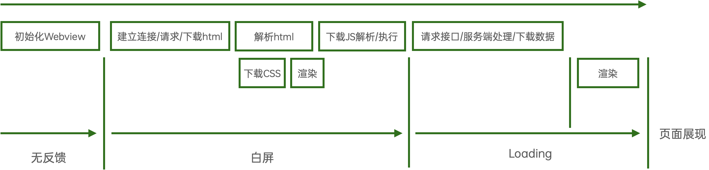

我们再归纳一下，将页面加载的整体过程总结为以下几个阶段：

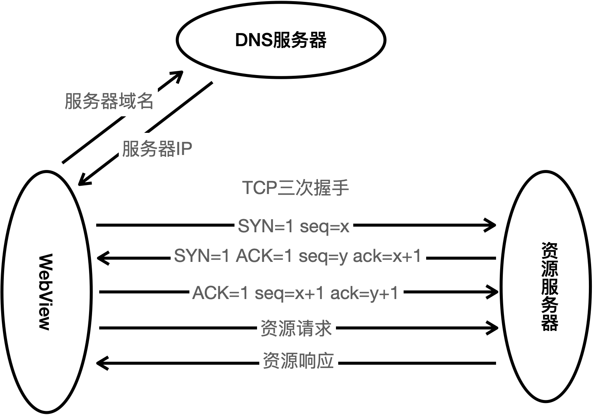

可以看到加载HTML文件、加载CSS文件、加载JS文件、加载接口数据是通过网络来进行的。这几个步骤也是整个页面可以完成加载的基础，任何一个环节出现问题都会影响到页面的加载。从加载的过程我们可以看出H5页面对于网络的依赖是非常大的。

### 1.2 网络状况

从前面的端内H5页面加载过程可以看出页面加载时的几个关键环节都是依赖于网络。随着谷歌公司的V8引擎的出现以及硬件设备的日益升级，目前Web引擎对于JavaScript的执行效率以及页面渲染效率已经非常高了，所以在页面加载时间里网络加载时间一般占了绝大的部分。页面通过网络下载资源的过程中会经过非常多的环节，任何一个环节出现抖动都会对网络的响应时间造成非常大的影响进而拉长页面加载的时间。

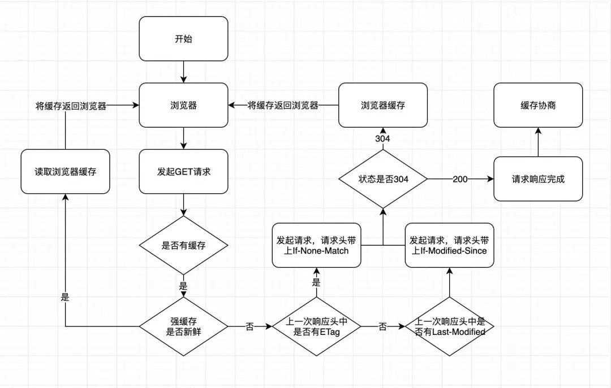

从上图可以看出完成一次HTTP请求需要完成多次网络交互，每一次交互都会受到网络延迟的影响，在最终的数据传输过程中也会受到用户信号状况的影响，如果用户网络状况不佳或资源文件较大可能会大大加长资源下载的时间。所以为了提高用户的页面加载速度，提高用户在弱网环境下打开页面的体验我们必须减少用户对于网络的依赖，即尽可能的减少或者消除网络请求。

## 2 方案调研

### 2.1 浏览器机制调研

#### 2.1.1 HTTP 缓存

本地缓存请求到的资源，后续请求尽可能直接复用这些资源，减少Http请求，从而显著提高网站和应用程序的性能。

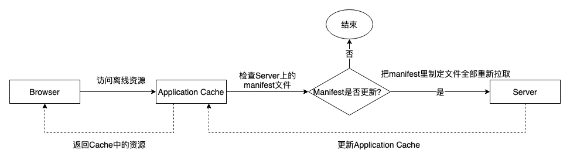

HTTP 的缓存机制主要是在服务器端通过 HTTP 报头的方式进行控制。其工作流程如下:

- **强缓存**：强缓存使用 `Expires` 和 `Cache-Control` 来设置。这两个报头都用于设置一个绝对的过期时间。设置这两个报头的静态资源被加载时，浏览器会检查是否过期，如果未过期，浏览器会直接加载资源，不会向服务器发起请求
- **协商缓存**：协商缓存主要使用以下报头来控制：
  - `Last-Modified` / `If-Modified-Since`：使用资源的更新时间来判断是否需要重新请求
  - `Etag` / `If-None-Match`：使用资源的唯一标识匹配来判断是否要重新请求

**局限性：**

- 缓存不可靠性
- 对于强缓存的资源，如果未过期，除非用户强制刷新，会一直使用旧的版本
- 无法使用程序干预和控制缓存
- 不支持离线

#### 2.1.2 Application Cache

HTML5 早期版本提供了 `Application Cache` 的缓存功能，在 `Service Worker` 提出之后，`Application Cache` 就从 Web 标准中移除了，在未来浏览器会停止支持。不过我们可以了解一下它的缓存原理：`Application Cache` 是基于一个 `manifest` 文件（缓存清单文件，一般后缀为 `.appcache`）的缓存机制。在该文件中定义需要缓存的文件，支持 `manifest` 的浏览器，会将按照 `manifest` 文件的规则，将文件保存在本地，之后当网络在处于离线状态时，浏览器会通过被离线存储的数据进行页面展示。主要应用在内容变动少、相对固定的场景下。其流程大致如下：

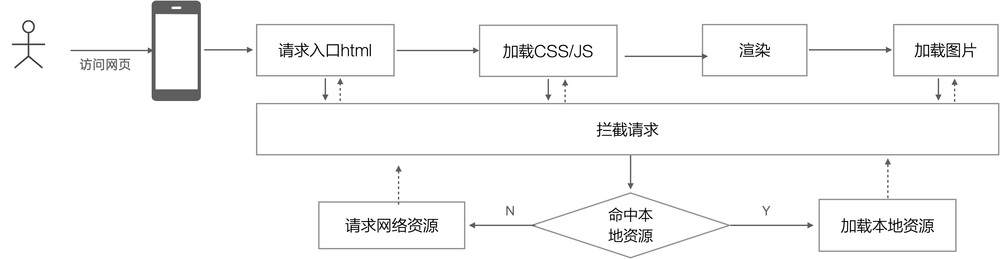

**优点：**

- 离线浏览，用户可在应用离线时使用它们
- 兼容性好，但是是废弃的 Web 标准，未来可能成为历史包袱
- `manifest` 缓存和浏览器 HTTP 缓存是独立的，不受其影响

**缺点：**

- 使用声明式设计声明缓存文件，不可编程
- 不同浏览器实现有些 bug
- API 存在较多设计缺陷

#### 2.1.3 PWA

目前 PWA（Progressive Web App）是最被推荐的应用模型。它基于 `Service Worker` 为 Web 应用提供编程式缓存和离线能力，PWA 不是一项技术，而是一套 Web 应用模式，旨在让我们 Web 应用能够更接近原生应用的使用体验。简单说它包含下列功能：

- 应用离线功能
- 支持安装到主屏幕，就像原生应用一样有 Icon，启动页面
- 通知推送功能
- 后台同步功能
- 安全性更高（比如授权凭证管理，强制 HTTPS）
- 更全面的原生功能调用

**渐进式**的含义在于，这些特性是以渐进式的方式增加的，比传统应用更好的同时保证了降级兼容。这里主要吸引我们的是它的离线能力。它的工作原理如下：

1. 在应用首次加载的时候，我们会注册一个 SW 脚本。这是一个 JavaScript 程序，在独立的"进程（Worker）"中运行，主要职责是管理缓存，推送等事务
2. 接着触发 `install` 事件。我们可以在这里将应用的全部缓存，或者离线核心文件全部预缓存下来
3. 安装成功后就触发了 `activate` 事件。在这里的主要工作是，当应用更新时，可以在这里删除缓存
4. 激活成功后，SW 就会在一个独立的进程中运行，不依赖于具体的页面，即使页面关闭的 SW 进程会一直运行（这说法不严谨，浏览器会根据资源情况，休眠 SW 进程，但是对于我们的页面来说，可以认为是一直在运行的）。激活成功后，SW 不能应用于当前页面，只有刷新或者新打开的页面才能被 SW 控制
5. 成功激活 SW 后续加载的页面都在 SW 控制范围内，在指定作用域请求的资源，会触发 `fetch` 事件，被 SW 拦截。所以说 SW 就是一个代理，在这里可以先检查缓存，如果缓存存在的话，则将响应直接返回给页面；如果不存在则向服务器发起请求，接着再缓存起来。使用 SW 有两种缓存方案：
   - **全站缓存**：直接在 `install` 事件中，将所有静态资源预缓存下来。这种方式可以保证更好的离线效果
   - **渐进式缓存**：在 `fetch` 事件中，边请求边缓存。对于非核心文件可以使用这种方式

**优点：**

- 架构侵入性低，正如其名，可以渐进式增强。不影响现有的应用的开发和兼容
- 引入成本低，完全由前端控制
- 开发和调试方便
- 编程式地控制应用缓存，可以实现更细粒度的缓存定制

**缺点：**

- 兼容性差，目前 Android Webview 仅在 Chromium 103 版本上支持
- 第一次打开没有预加载机制，我们还是要做首屏优化，因为只有在首次加载之后才能被缓存

### 2.2 客户端能力调研

#### 2.2.1 file协议方案

传统 Hybrid 应用主要以 `Cordova` 为代表。它的工作方式是将前端应用打包进原生应用中，然后使用 `file://` 协议页面进行加载；另外通过 `Bridge` 桥接方式给应用提供一定的原生访问能力。

**优点：**

- 永久缓存，静态资源加载不需要经过网络，可以可靠地渲染出页面
- 支持所有客户端，不存在兼容性问题
- 客户端自定义实现离线化，高度定制化

**缺点：**

- 丢失了 Web 的更新灵活性，所以我们需要自定义更新协议，来弥补这个缺陷
- 接入成本高，现有页面无法直接应用，且对前端开发侵入性较强
- 访问本地资源可能导致资源路径泄漏产生安全问题
- 可能无法通过某些浏览器的安全设置，导致功能受限

#### 2.2.2 Webview拦截方案

这个方案类似于PWA，只不过做拦截的是客户端的Webview，而不是 `Service Worker`。简单说就是Webview 拦截页面发起的所有请求，检查是否匹配离线包，如果不匹配则放行，让其请求远程服务器：

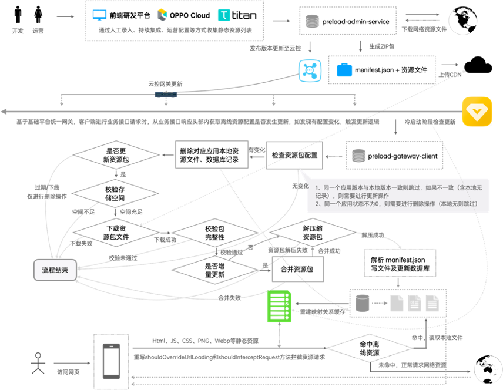

**优点：**

- 和PWA一样，对前端无侵入性，不需要修改现有的前端架构
- 和PWA一样渐进增强，支持向下兼容
- 可以实现共享资源的拦截
- 客户端自定义实现离线化，高度定制化

### 2.3 业界实现方案调研

### 2.4 方案确定

不同方案有不同的优缺点和引入成本，结合我们的应用场景我们会主要从以下几点来考虑方案的可行性：

- **兼容性**：是否兼容大部分Webview版本，确保功能覆盖大部分用户并能够取得预期的效果
- **向下兼容性**：功能是否能够向下兼容或者存在降级方案，确保页面在不同版本下的可用性
- **动态更新**：是否具备稳定可控的动态更新能力，确保资源能够及时更新或回退
- **接入成本**：方案是否需要对现有页面进行侵入性改造，或者现有页面是否能够低成本应用
- **技术成熟度**：技术是否成熟稳定，可具备良好的可维护性和扩展性

根据对比结果结合业界主流实现方案，我们最终选择基于Webview拦截技术，自研离线包SDK及离线包管理平台系统的方案。

## 3 概要设计

### 3.1 整体思路

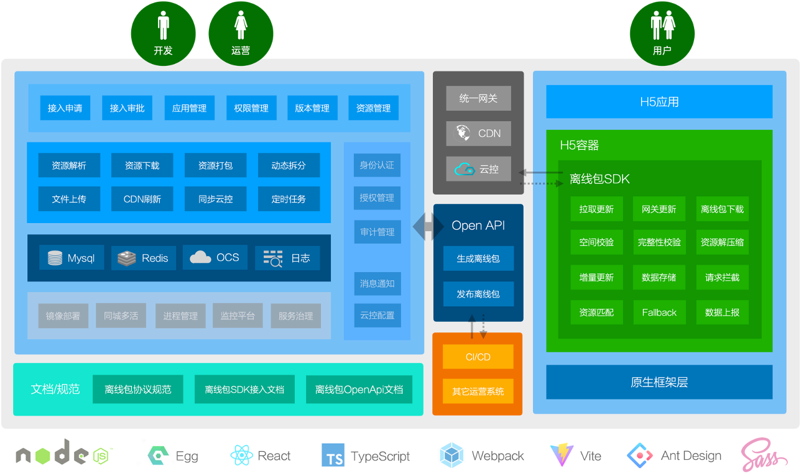

### 3.2 架构设计

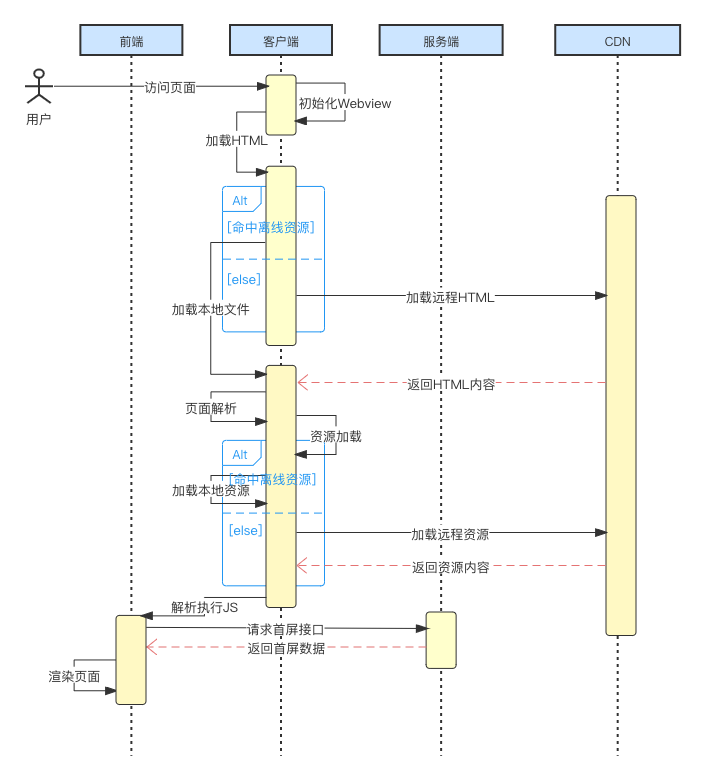

## 4 详细设计

### 4.1 离线包SDK设计

#### 4.1.1 整体流程

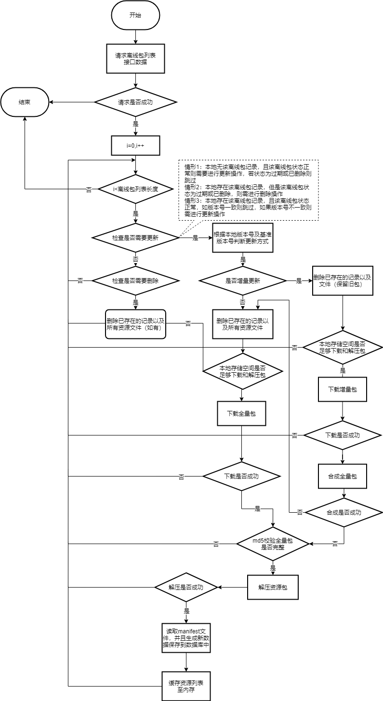

#### 4.1.2 更新流程

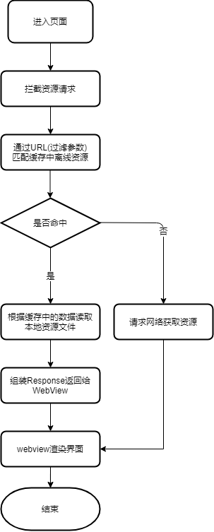

#### 4.1.3 拦截流程

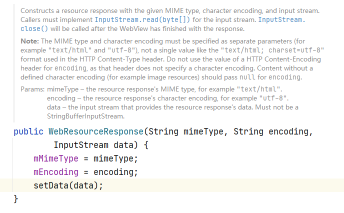

1. 在 `UwsWebViewClient` 的 `shouldInterceptRequest` 方法拦截对应的url
2. 判断url与资源文件的映射数据是否已经加载到内存中，如果未加载，则加载到内存中
3. 根据url与资源文件的映射找到对应的文件，url与资源文件的映射保存在 `manifest.json`
4. 把资源文件读取到 `InputStream`，然后创建一个 `WebResourceResponse`，并把 `InputStream` 传递给 `WebResourceResponse`

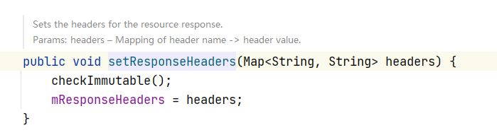

5. 把 `manifest.json` 文件中的 `headers` 读取出来，并且转换成map，最后把这个map设置到 `WebResourceResponse` 的响应头中


6. 最后把 `WebResourceResponse` 返回给到 `Webview`

#### 4.1.4 模块划分

离线包SDK主要包含以下模块：

- **preload-api**
- **preload-network**：网络库，引入了ucbasic、retrofit以及gson等库
- **preload-download**：下载库，实现通用下载功能
- **preload-res**：包含整个离线包的逻辑处理，主要分为：离线能力管理、离线包更新逻辑、缓存管理、资源命中逻辑：
  - **离线能力管理**：包括初始化以及离线包管理平台给接入应用分配的appId的管理，appId的管理使用单例，防止相同appId多次初始化
  - **离线包更新逻辑**：包括配置请求、离线包下载、资源数据入库、资源数据添加到缓存等逻辑
  - **缓存管理**：是对资源数据的一个内存缓存，资源更新后需要更新缓存，是否命中的数据从缓存中读取；缓存使用LruCache进行缓存，目前设置的是5MB，为解决线程安全问题，里面使用读写锁控制缓存的读写
  - **资源命中逻辑**：把命中的资源组装成一个WebResourceResponse，Webview可以直接使用该WebResourceResponse进行渲染，为了跟真实网络请求一样，需要把请求头也添加到WebResourceResponse中，同时还需要设置状态码等数据

#### 4.1.5 核心类设计

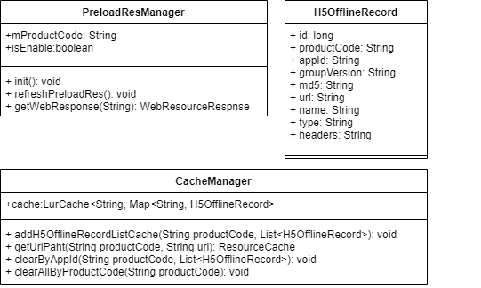

#### 4.1.6 持久化存储设计

#### 4.1.7 接口设计

### 4.2 离线包管理平台设计

#### 4.2.1 用户界面功能划分

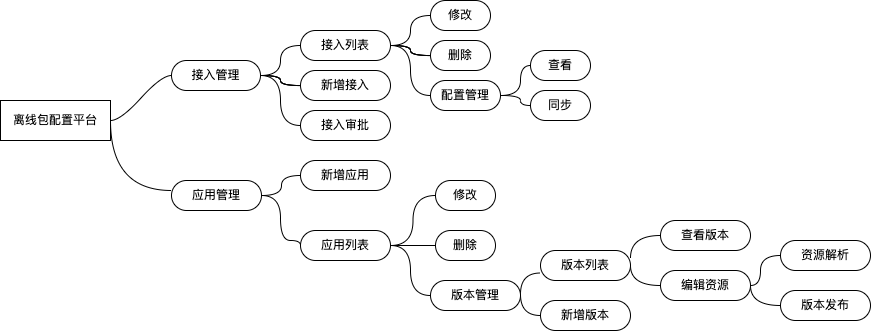

#### 4.2.2 服务层核心类设计

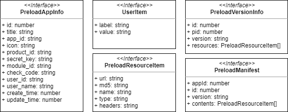


```typescript
interface ApiError {
  code: number
  message: string
  errorData?: Record<string, any>
}

interface ApiResponse {
  success: boolean
  error?: ApiError
  data?: Record<string, any>
}
```

#### 4.2.3 服务层功能设计

##### 4.2.3.1 资源解析

**方案一**：利用框架提供的HttpClient（基于 urllib 模块的扩展），对目标页面地址发送HTTP请求，利用 cheerio（为服务器特别定制的 jQuery核心实现）进行HTML解析，提取出引用的静态资源文件路径。

```typescript
await ctx.curl(pageUrl, { dataType: "text", timeout: 3000 })
```

**方案二**：利用无头浏览器（Puppeteer）模拟客户端访问目标页面，动态解析页面引用的资源文件路径。

利用框架内置的 `ctx.isSafeDomain` 校验域名，配置域名白名单，仅支持白名单内域名的资源解析：

```json
{
  "domainWhiteList": ["127.0.0.1", ".oppo.com", ".heytapdownload.com", ".heytap.com", ".realme.com", ".oneplus.com", ".wanyol.com", ".myoas.net", ".realmebbs.com", ".oppo.cn", ".oneplusbbs.com", ".heytapmobi.com", ".coloros.com", ".oppoer.me", ".oppomobile.com", ".heythings-iot.com", ".finzfin.com", ".myoas.com", ".opposhop.cn", ".coloros.net", ".opposhop.in", ".myoppo.com", ".heytapimage.com", ".oneplus.cn", ".ibreeno.com", ".heytapimg.com"]
}
```

##### 4.2.3.2 资源下载

利用框架提供的HttpClient（基于 urllib 模块的扩展），对目标页面地址发送HTTP请求，将相应的Buffer保存成文件：

```typescript
import fs from "fs-extra"
import { createHash } from "crypto"

const name = createHash("md5").update(url).digest("hex")
fs.writeFileSync(`${sourceFolder}/${name}`, res.data, "utf8")
```

##### 4.2.3.3 资源打包

使用 archiver 对目录内的资源文件进行打包，打包成功后计算md5值作为完整性校验值。

```typescript
import archiver from "archiver"

const packages = `${workFolder}/packages.zip`
const output = createWriteStream(packages)
const archive = archiver.create("zip", { zlib: { level: 9 } })
output.on("close", resolve)
archive.pipe(output)
archive.directory(sourceFolder, false)
archive.finalize()
```

##### 4.2.3.4 动态拆分

使用 bsdiff-node 对两个版本的全量包进行diff操作，生成增量包文件。

```javascript
const bsdiff = require('bsdiff-node');

const oldFile = path.join(__dirname, '1.0.0.zip');
const newFile = path.join(__dirname, '1.0.1.zip');
const patchFile = path.join(__dirname, '1.0.0_1.0.1.patch');

await bsdiff.diff(oldFile, newFile, patchFile);
```

**离线生成：**

发布离线包版本时，遍历历史离线包版本，根据基准版本号计算生成增量包的链接列表。

- 比如最新版本为 `0.0.10`，基准版本为 `0.0.5`，则需要生成增量包的版本号为 `["0.0.5", "0.0.6", "0.0.7", "0.0.8", "0.0.9"]`
- 根据离线包协议规范定义的增量包命名规范，计算出离线包文件列表：`["0.0.5_0.0.10.patch", "0.0.6_0.0.10.patch", "0.0.7_0.0.10.patch", "0.0.8_0.0.10.patch", "0.0.9_0.0.10.patch"]`，依次生成增量包文件并上传至对象存储

**提前预热：**

根据上面的文件列表，结合CDN配置，调用CDN批量预热文件接口，创建预热任务。

##### 4.2.3.6 CDN刷新/预热

使用CDN API实现URL刷新及预热。

**签名逻辑：**

1. 申请SecretId和SecretKey（参考上述BizOcsConfig 与对象存储配置一起配置）
2. 对参数排序
3. 拼接请求字符串
4. 生成签名串

```typescript
const { secretId, secretKey, ...resultData } = options
const timestamp = Date.now()
const nonce = Math.floor(Math.random() * 10000 * 10000)
const data = { Timestamp: timestamp, Nonce: nonce, SecretId: secretId, ...resultData }
const array: string[] = []

for (const x in data) {
  const v = typeof data[x] === "object" ? JSON.stringify(data[x]) : String(data[x])
  array.push(`${x}=${v}`)
}
array.sort()

const api = `http://apicdn.ops.oppo.local${url}`
data.Signature = createHmac("sha1", secretKey).update(`POST${api}?${array.join("&")}`).digest("base64")

const result = await ctx.curl(api, { method: "POST", data, contentType: "json", dataType: "json" })
```

**刷新接口：**

- 请求参数：
- 返回结构：

**预热接口：**

- 请求参数：
- 返回结构：

##### 4.2.3.7 同步云控

使用云控Open API实现配置项创建和更新，根据4.3.4方案约定，配置编码固定为 `P001`。

**签名逻辑：**

```typescript
const timestamp = Date.now()
const sign = createHash("md5").update(`${timestamp}|_|${productId}|SEC|${secretKey}_||_${JSON.stringify(data)}`).digest("hex")
```

**产品ID 以及秘钥获取：**

先在mdp移动开发平台创建空间应用后接入云控配置组件进入云控配置控制台，若团队已有空间或者应用，可直接进入获取产品ID，如下图所示：

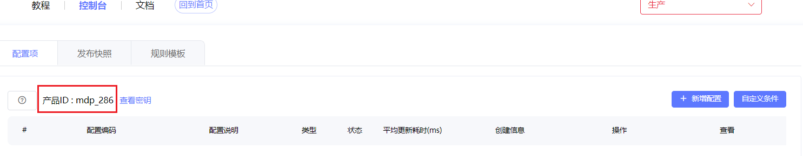

此产品ID作为 `productId` 参数参与发起请求。

秘钥在云控控制台的下图位置：

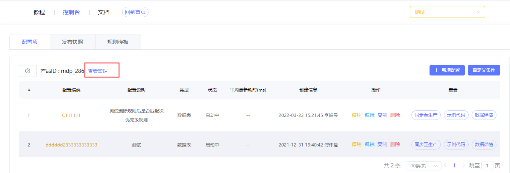

**接口调用地址：**

**创建配置项接口：**

请求参数：

请求体示例：

```json
{
  "userId": "",
  "userName": "",
  "productId": "",
  "secretKey": "",
  "code": "P001",
  "name": "资源预加载更新配置",
  "type": 1,
  "protocolValue": "{\"data1\":\"key\",\"data2\":\"value\"}"
}
```

响应示例：

```json
{
  "data": {
    "id": 152745013883834368,
    "userId": "",
    "userName": "",
    "productId": "",
    "secretKey": "",
    "code": "P001",
    "name": "资源预加载更新配置",
    "type": 1
  },
  "msg": "SUCCESS",
  "status": 200,
  "success": true
}
```

**更新配置接口：**

请求参数：

请求体示例：

```javascript
{
  userId: appInfo.user_id,
  userName: appInfo.user_name,
  productId: appInfo.product_id,
  secretKey: appInfo.secret_key,
  moduleCode: "P001",
  upsertRuleList: [
    {
      id: appInfo.module_id,
      externalId: `${appInfo.id}_${appInfo.app_id}`,
      name: "资源预加载最新配置校验值",
      description: `${appInfo.title}(${appInfo.app_id})`,
      dimensionConfig: [],
      configValue: [
        {
          data1: "checkCode",
          data2: md5
        }
      ]
    }
  ]
}
```

响应示例：

```json
{
  "data": {
    "userId": "",
    "userName": "",
    "productId": "",
    "secretKey": "",
    "moduleCode": "P001",
    "addRuleList": [
      {
        "id": "appInfo.module_id",
        "externalId": "",
        "name": "资源预加载最新配置校验值",
        "dimensionConfig": [],
        "configValue": [
          {
            "data1": "checkCode",
            "data2": "md5"
          }
        ]
      }
    ]
  },
  "msg": "SUCCESS",
  "status": 200,
  "success": true
}
```

##### 4.2.3.8 定时任务

利用Egg框架提供的定时任务能力，在 `app/schedule` 目录下编写定时任务，用于实现过期失效逻辑，设计上约定过期时间统一为每日的23:59:59，所以定时任务为每日的00:01:00执行，定时类型为 `worker`，即每台机器上只有一个 worker 会执行这个定时任务，每次执行定时任务的 worker 的选择是随机的。

同时使用redis分布式锁避免任务重复执行。

```typescript
export default class UpdateConfig extends Subscription {
  static get schedule() {
    return {
      cron: "1 0 0 * * ?",
      type: "worker"
    }
  }
}
```

#### 4.2.4 表结构设计

##### 4.2.4.1 接入应用表

数据表名称：`preload_app_record`

数据表创建SQL：

```sql
CREATE TABLE `preload_app_record` (
  `id` int(11) unsigned NOT NULL AUTO_INCREMENT,
  `title` varchar(16) NOT NULL DEFAULT '',
  `app_id` varchar(32) NOT NULL DEFAULT '',
  `icon` varchar(128) NOT NULL DEFAULT '',
  `user_id` varchar(8) NOT NULL DEFAULT '',
  `product_id` varchar(16) NOT NULL DEFAULT '',
  `module_id` varchar(18) NOT NULL DEFAULT '',
  `secret_key` varchar(32) NOT NULL DEFAULT '',
  `check_code` varchar(32) NOT NULL DEFAULT '',
  `user_name` varchar(16) NOT NULL DEFAULT '',
  `create_time` timestamp NOT NULL DEFAULT CURRENT_TIMESTAMP,
  `update_time` timestamp NULL DEFAULT NULL ON UPDATE CURRENT_TIMESTAMP,
  PRIMARY KEY (`id`),
  UNIQUE KEY `app_id` (`app_id`)
) ENGINE=InnoDB DEFAULT CHARSET=utf8mb4;
```

##### 4.2.4.2 离线包业务表

数据表名称：`preload_package_record`

数据表创建SQL：

```sql
CREATE TABLE `preload_package_record` (
  `id` int(11) unsigned NOT NULL AUTO_INCREMENT,
  `title` varchar(16) NOT NULL DEFAULT '',
  `max_size` int(2) unsigned NOT NULL DEFAULT '2',
  `version` varchar(16) NOT NULL DEFAULT '',
  `version_id` int(11) unsigned DEFAULT NULL,
  `base_version` varchar(16) NOT NULL DEFAULT '',
  `apps` json DEFAULT NULL,
  `users` json DEFAULT NULL,
  `user_id` varchar(8) NOT NULL DEFAULT '',
  `user_name` varchar(16) NOT NULL DEFAULT '',
  `state` int(1) unsigned NOT NULL DEFAULT '1',
  `create_time` timestamp NOT NULL DEFAULT CURRENT_TIMESTAMP,
  `update_time` timestamp NULL DEFAULT NULL ON UPDATE CURRENT_TIMESTAMP,
  `publish_time` timestamp NULL DEFAULT NULL,
  `expire_time` timestamp NULL DEFAULT NULL,
  PRIMARY KEY (`id`)
) ENGINE=InnoDB DEFAULT CHARSET=utf8mb4;
```

##### 4.2.4.3 离线包版本表

数据表名称：`preload_version_record`

数据表创建SQL：

```sql
CREATE TABLE `preload_version_record` (
  `id` int(11) unsigned NOT NULL AUTO_INCREMENT,
  `pid` int(11) unsigned NOT NULL,
  `version` varchar(16) NOT NULL,
  `resources` json DEFAULT NULL,
  `user_id` varchar(8) NOT NULL DEFAULT '',
  `user_name` varchar(16) NOT NULL DEFAULT '',
  `url` varchar(128) NOT NULL DEFAULT '',
  `md5` varchar(32) NOT NULL DEFAULT '',
  `size` int(11) unsigned DEFAULT NULL,
  `state` int(1) unsigned NOT NULL DEFAULT '1',
  `create_time` timestamp NOT NULL DEFAULT CURRENT_TIMESTAMP,
  `update_time` timestamp NULL DEFAULT NULL ON UPDATE CURRENT_TIMESTAMP,
  PRIMARY KEY (`id`)
) ENGINE=InnoDB DEFAULT CHARSET=utf8mb4;
```

### 4.3 增量更新能力设计

#### 4.3.1 技术选型

业内比较流行的差分方案主要有：bsdiff、Xdelta3和Courgette。最后一个方案Courgette来自于谷歌，主要解决的是可执行文件的差分，而我们的离线包场景主要包含各种静态资源文件。所以，我们主要对比bsdiff和Xdelta3方案。

通过3个资源包的实验数据对比，bsdiff在压缩比、压缩效率及内存占用下均符合预期，因此我们选用了bsdiff作为增量更新方案。

#### 4.3.2 核心流程

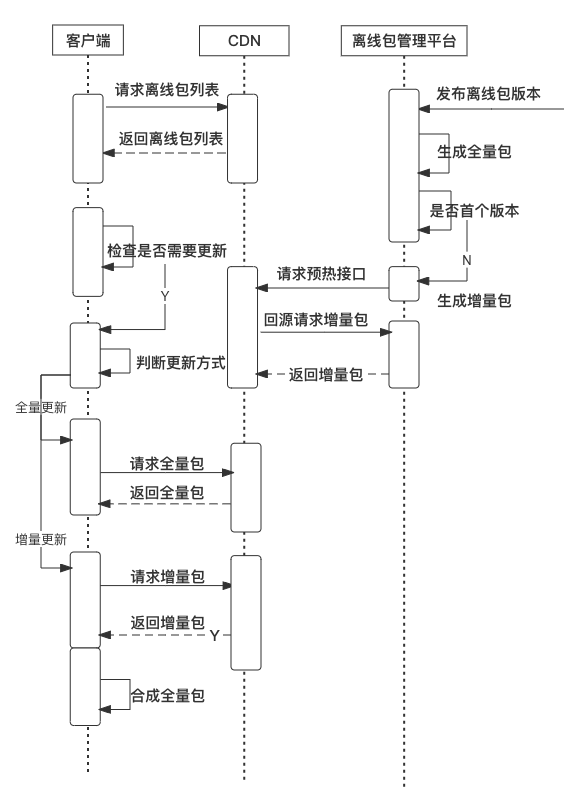

### 4.4 动态更新能力设计

#### 4.4.1 方案确定

业界常见的更新检查触发方案有：

##### 4.4.1.1 定时轮询拉取

即定时向后台发起请求，检查和判断后端是否有配置数据更新。虽然可能能够达到比较好的实时性，但很显然，会带来非常多的流量浪费，而且对后端也会带来非常多无用的请求，造成资源的浪费。

##### 4.4.1.2 Push推送更新

在新配置发布后，才会向在线用户下发变更通知，然后用户去拉取配置，这种方式可以极大的降低流量损耗，但也存在两个问题，一是需要维护稳定的长连接通道，有一定技术成本，二是对于已断开的用户，会导致无法收到变化通知，不能保证配置的正确性。

##### 4.4.1.3 网关参数下发

在经过网关时，带上对应配置版本。服务端网关根据请求中的配置版本，发给配置中心，由配置中心相关服务将参数透传给后台，后台根据详细参数比对是否有新配置，有则返回版本号给网关。网关在业务后端响应请求时，将配置版本号同步传给客户端。

客户端根据配置项版本变化，向配置中心后台或者CDN拉取最新配置，完成配置项的更新，并通知业务侧做实时变化。

结合方案合理性、开发成本、业务成本等因素综合对比，我们更倾向于第三种策略来完成配置的更新检查通知。结果调研公司内已存在类似中间件：云控配置，且部分内的应用均已完成接入，所以复用云控配置的网关更新能力成为我们实现动态更新能力的最佳方案。

#### 4.4.2 云控配置更新流程

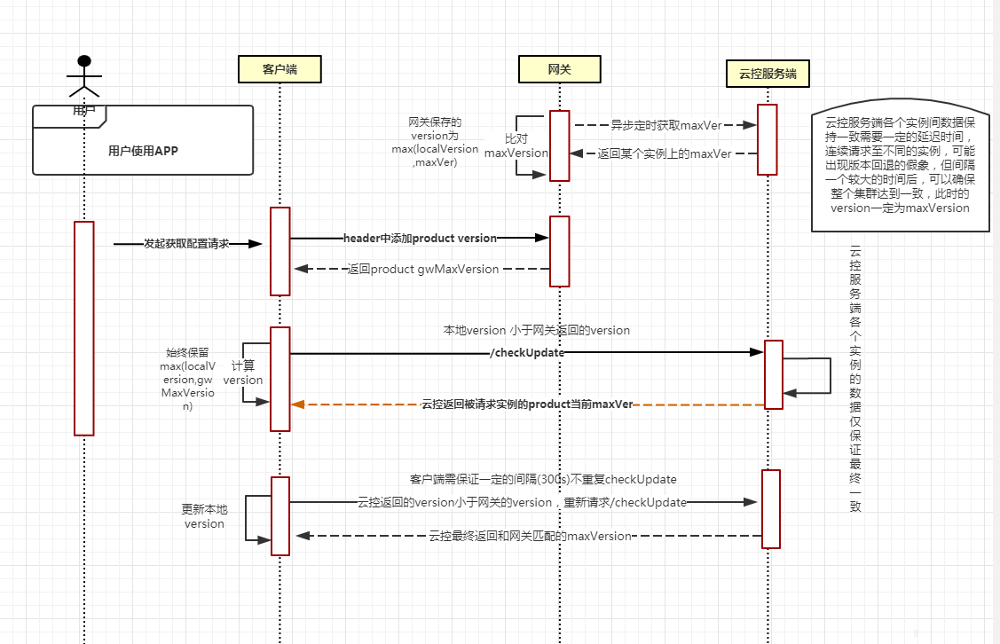

#### 4.4.3 离线包配置更新流程

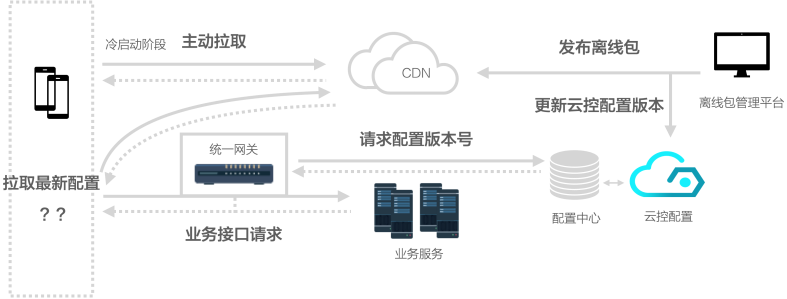

#### 4.4.4 方案约定

- 离线包SDK依赖云控配置的网关更新能力，所以要求接入应用已完成云控的接入。如未接入，请参照云控接入文档完成接入
- 接入应用接入时需提供在云控配置平台分配的产品ID和密钥，该产品ID和密钥会被储存至离线包配置平台用于与云控平台的API调用
- 接入应用接入时离线包配置平台会使用提供的产品ID和密钥调用云控创建配置项接口创建编码为 `P001` 的配置项，如创建成功则代表产品ID和密钥无误
- 客户端固定检查编码为 `P001` 的配置项更新情况，该配置项的配置内容key固定为 `checkCode`，值为对应版本离线包配置列表的配置计算生成的md5值，可用于数据一致性校验

### 4.5 HTTP接口设计

#### 4.5.1 接口域名列表

#### 4.5.2 获取离线包列表

返回说明：

返回示例：

```json
{
  "success": true,
  "data": {
    "apps": [
      {
        "appId": 1,
        "status": 1
      },
      {
        "appId": 2,
        "status": 2
      },
      {
        "appId": 5,
        "status": 0,
        "baseVersion": "0.0.1",
        "version": "0.0.7",
        "url": "https://titan-test.wanyol.com/preload/5/0.0.7.zip",
        "md5": "617c55fc74395f3c5308c7cc7cd4a236",
        "size": 6070816
      }
    ],
    "time": 1649733531787
  }
}
```

### 4.6 安全性设计

#### 4.6.1 文件完整性

离线包管理平台在发布离线包时会计算全量包的md5值，并随配置下发，客户端在完成全量包的下载或Patch后，计算得到全量包的md5并与之进行对比确保文件完整。

```typescript
import { createHash } from "crypto"

const buffers = readFileSync(packages)
const md5 = createHash("md5").update(buffers).digest("hex")
```

#### 4.6.2 数据一致性

离线包管理平台在某个资源包发生变更时会重新计算生成配置文件，并计算配置文件的md5值并同步给云控配置中心，客户端用通过网关更新机制获取到最新的校验值与资源包配置数据计算出的md5值进行对比确保数据一致性。

```typescript
import { createHash } from "crypto"

const data: PreloadAppConfig = { apps: [], time: Date.now() }
const md5 = createHash("md5").update(JSON.stringify(data.apps)).digest("hex")
```

#### 4.6.3 传输安全性

所有接口及资源数据全部强制使用HTTPS。

### 4.7 边界条件处理

- 如4.1.2中的更新流程所示，所有的异常处理均有对应的兜底措施。如增量包下载或合成失败，则会fallback至全量更新流程
- Webview拦截如未命中离线资源则fallback至网络资源，如命中资源但读取本地文件出错（文件不存在、IO异常）等则fallback至网络资源
- 增量更新能力为二期优化能力，设计上支持向下兼容，即老版本继续走全量更新，新版本根据基准版本号判断更新方式

### 4.8 埋点与效果指标

#### 4.8.1 关键路径埋点

- 离线包列表配置接口读取异常
- 离线包下载成功、失败埋点（含下载时间、失败原因）
- 离线包更新成功、失败埋点（含更新方式）
- 资源拦截命中情况埋点
- 前端埋点：页面DomContentLoaded、FCP指标数据上报（区分是否命中离线资源）

#### 4.8.2 效果指标定义

- **离线资源命中率**：以页面维度，计算命中离线资源的PV数 / 页面总PV数
- **离线包下载成功率**
- **离线包更新成功率、覆盖率**
- **增量更新占比**
- **前端性能提升率**（DomContentLoaded、FCP）

### 4.9 监控告警设计

- 利用先知的业务告警能力，针对离线包列表配置接口读取异常、离线包下载、更新成功率偏低等异常情况进行短信、TT、邮件等方式告警
- 针对离线包配置平台发布离线包查询CDN刷新失败、同步云控配置失败等异常情况，通过TT群机器人进行告警


### 4.10 应急与灰度机制设计

受益于云控配置的条件下发能力，我们针对离线包能力设置了云控配置开关，可以根据下列维度的条件下发不同的配置来应对突发情况或实现灰度能力。

---

## 附录 离线包协议规范

### 1 介绍

#### 1.1 本协议规范涉及的问题域

- 定义本协议中每个子规范需要被支持的 Level
- 定义本协议相关的领域名词
- 定义离线包版本号规范（A）
- 定义离线包协议规范（A）

#### 1.2 协议中子规范 Level 定义

### 2 术语和定义

- **离线包**：包含 HTML、JavaScript、CSS 等页面内静态资源的压缩包。预先下载该资源包至客户端本地，在用户访问页面时摆脱对网络环境的依赖直接从本地加载资源
- **全量包**：包含单个离线包版本完整资源的压缩包
- **增量包**：包含两个离线包版本之间的增量部分，本协议规范中特指由bsdiff计算两个版本全量包产生的 `.patch` 文件
- **基准版本号**：用于判断是否进行增量更新的主要条件，只有大于该版本号的更新可以进行增量更新，否则需进行全量更新。默认为第一个 `major` 版本，也可以在离线包配置平台指定

### 3 离线包版本号规范（A）

离线包版本号采用Semver（Semantic Versioning）语义化版本号，版本号格式为 `major.minor.patch` 的形式。

- **major** 是大版本号：用于发布不向下兼容的资源修改
- **minor** 是小版本号：用于发布向下兼容的资源新增
- **patch** 是补丁号：用于发布向下兼容的资源修正

### 4 离线包协议

#### 4.1 协议结构（A）


离线包是一个 `.zip` 格式的压缩文件，它由HTML、JavaScript、CSS等静态资源文件以及一个固定配置文件 `manifest.json` 组成。

#### 4.2 manifest.json（A）

```json
{
  "id": 1,
  "version": "0.0.1",
  "contents": [
    {
      "url": "https://titan-test3.wanyol.com/pages/57565267551619072/index.html",
      "name": "282b49c068eac5f610e5d82d597b57a9",
      "md5": "d4f910a14a7363e0ddd26b099caf73a8",
      "type": "text/html",
      "headers": "{\"last-modified\":\"Thu, 31 Mar 2022 07:35:48 GMT\",\"etag\":\"\\\"624559d4-538\\\"\",\"cache-control\":\"max-age=300\",\"accept-ranges\":\"bytes\",\"x-backend-host\":\"0716:8192\",\"x-gateway-host\":\"...\"}"
    },
    {
      "url": "https://titan-test3.wanyol.com/com/titan-demo/0.0.1/component.css",
      "name": "3e173de1383852679d09ea51e5309395",
      "md5": "1dcde7b47863bf94e437895fc9867cdd",
      "type": "text/css",
      "headers": "{}"
    }
  ]
}
```

#### 4.3 资源文件描述（A）

```typescript
interface PreloadResourceItem {
  url: string
  md5: string
  name: string
  type: string
  headers: string
}
```

#### 4.4 离线包命名规范（AA）

- 离线包文件命名约定为：`版本号` + `.zip`，例如：`0.0.1.zip`
- 增量包文件命名约定为：`旧版本号` + `_` + `新版本号` + `.patch`，例如 `0.0.1_0.0.2.patch` 表示 `0.0.1` 版本和 `0.0.2` 之间更新产生的增量包
